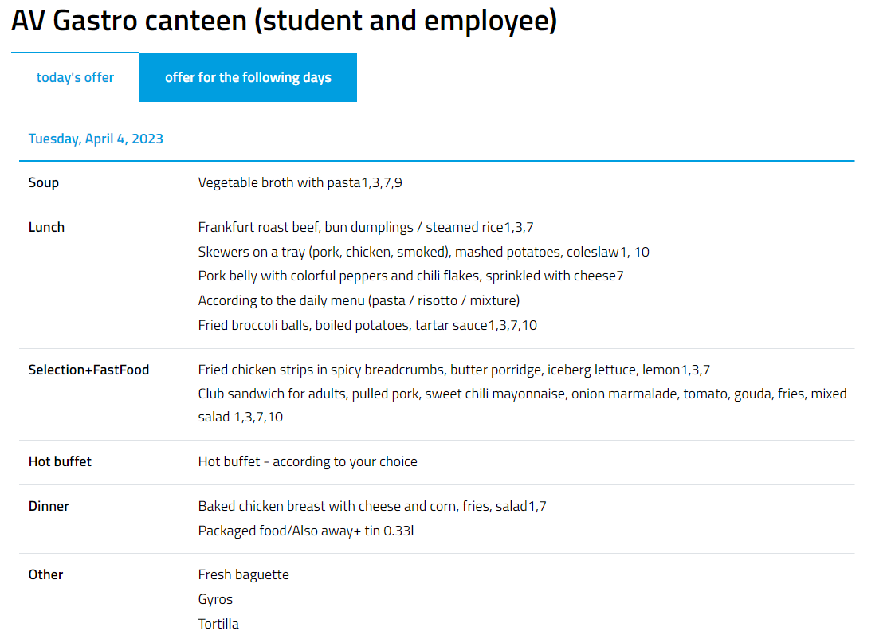
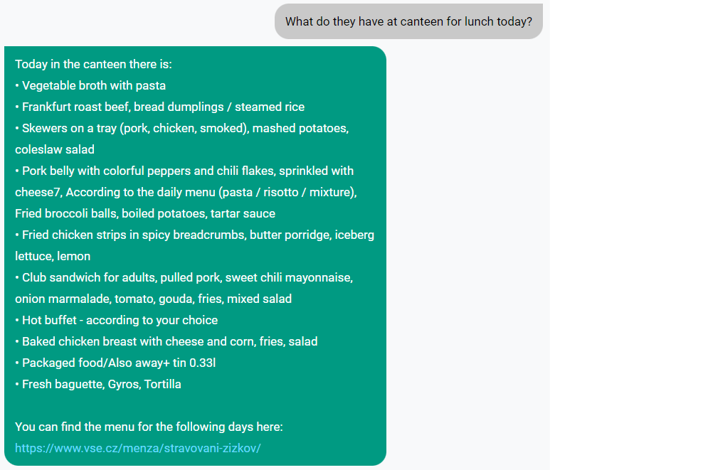
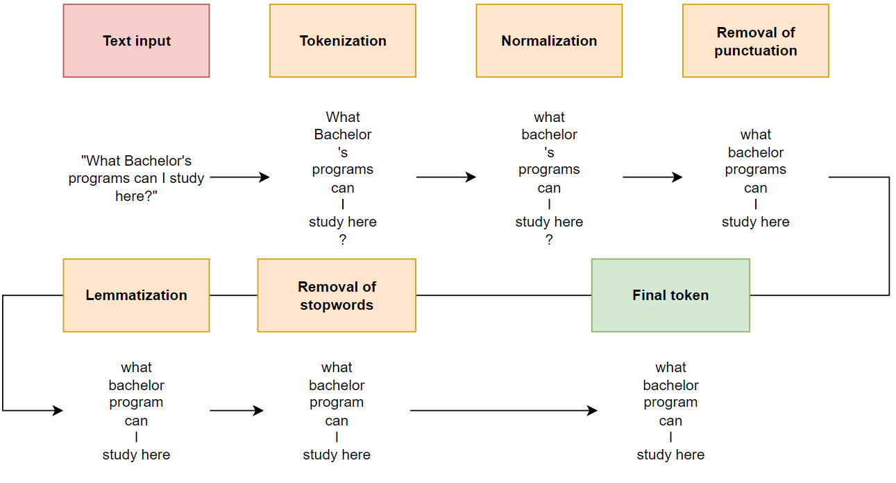

# **NLP Chatbot for FIS VŠE (Neural Network with Focal Loss)**

## **Team**:
   - **Machine Learning Team** - responsibility for text processing, development and deployment of chatbot as ML web application.
      - **Team Lead & Developer**: [**Petr Nguyen**](https://www.linkedin.com/in/petr-ngn/)
      - **Support**: [Lukas Dolezal](https://www.linkedin.com/in/lukas-dolezal75/)
   - **Business Analysts**: - responsibility for research, assessment of current chatbot solutions, project management.
      - **Members**: [Peter Kachnic](https://www.linkedin.com/in/peterkachnic/), [Karolina Benkovicova](https://www.linkedin.com/in/karolina-benkovicova-460/), [Andrea Novakova](https://www.linkedin.com/in/andrea-novakova/), [Samuel Nagy](https://www.linkedin.com/in/samuel-nagy-a31b51113/), [Adrian Harvan](https://www.linkedin.com/in/adrian-harvan/)

## **Project Assignment Proposal**
Within the course __*Trends in business analytics II (4IT409)*__, supervised by [Filip Vencovsky, Ph.D.](https://www.linkedin.com/in/filipvencovsky/), we had to:
   1. conduct a business research regarding the current chatbot of Faculty of Informatics and Statistics at Prague University of Economics and Business (**FIS VŠE**), assess its features and propose improvements, and further,
   2. implement our improvements in the deployment either (1) using already existing frameworks or pretrained chatbots/models or (2) developing our own chatbot from scratch.

<b>Particularly, we have developed our custom chatbot from scratch solely in Python (back-end) and HTML (front-end). More precisely, we have developed 2 custom chatbots - one in Czech language and one in English language.</b>

## **Data source & Integration description**

We created **41** own intents (for each language) by ourselves which regard for instance:
- Bachelor / master / minor specialization / doctoral study programs at FIS VŠE,
- Compulsory courses of given study programs,
- DAB (Data and Analytics for Business) alumni club,
- Study department of FIS VŠE,
- Leadership of FIS VŠE,
- Dormitories,
- Credit system,
- Actual food menu at canteen,
- Actual public transports near by VŠE
- <i>All the intents can be found [here (Czech language)](./files/cs/cs_intents.json) or [here (English language)](./files/cs/cs_intents.json) respectively. </i>

Regarding the last two intents (canteen and public tranport), such intents are integrated with other external system sources, from which we are web scrapping our desired information. Thus, our chatbot's responses related to such intents will be dynamic depending on the web scrapped information (since the canteen's menu is updated once a day and the public transport departure times will depend on the part of the day).

<b>Canteen</b> - from VŠE website, we are web scrapping a food menu at VŠE's canteen (available [here](https://www.vse.cz/menza/stravovani-zizkov/)) for the actual date using `requests` and `BeautifulSoup`. <i>Note, since the canteen's menu is not available in English, we use `GoogleTranslator API` to translate the menu from Czech into English.</i>
   - Website's menu:

   

   - Chatbot's response:

   

<b>Public tranport</b> - we are also web scrapping actual bus and tram public transports from Prague Integrated Public Transport ([PID](https://pid.cz/en/departures/)) using `requests` and Golemio API - TBD (waiting for Samuel's and Andrea's inputs).

   - Public transport's website:

   - Chatbot's response:

## **Text Processing**

In order to either train Neural Network or make chatbot to respond based on user's input question, we need such given text(s) preprocessed in an appropriate way.

First we perform **Cleaning & Tokenization** of given input text:
- **Tokenization**: based on input text, we split the text into single words or symbols, called as tokens.
- **Normalization** make each token a lowercase token. This applies to capitalized words. We also excplictly defined a constraint that normalization will not be applied to uppercase words. add WHY?

We created our own intents of questions which were the most relevant to study at FIS VŠE, which were further preprocessed using NLTK (for tokenization) and Majka (for lemmatization of Czech terms) into bag of words based on which we developed a custom neural network in Keras which was further tuned using Bayesian Optimization.

Using such developed neural network, we then built a custom chatbot which we deployed as a ML web application using Flask - the interface was built using HTML and Javascript for user-friendly experience with the chatbot.

## **Neural Network Development**

