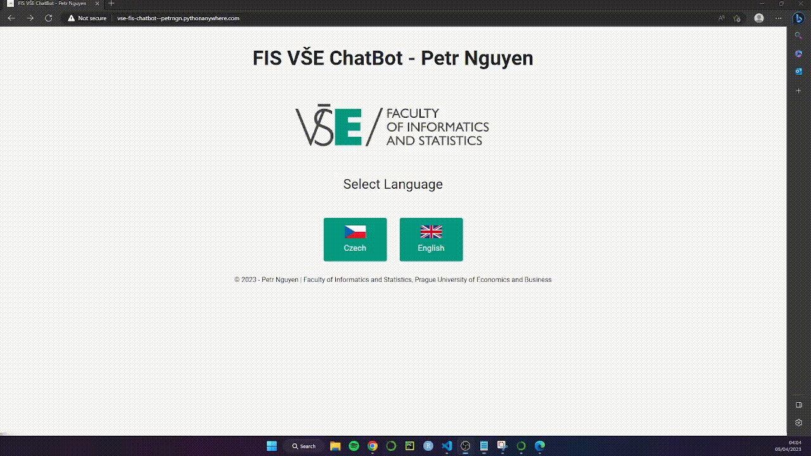
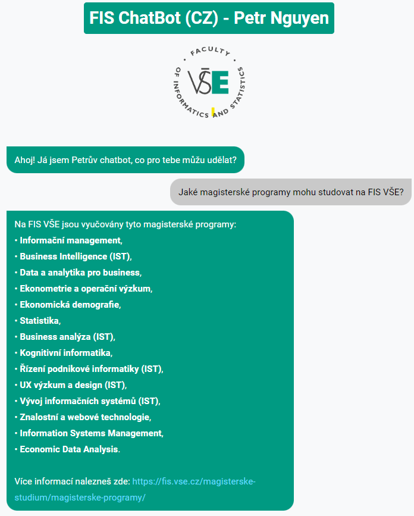

# **NLP Chatbot for FIS VŠE (Neural Network with Focal Loss)**

This custom chatbot framework temporarily runs on **Python Anywhere** cloud platform: [http://vse-fis-chatbot--petrngn.pythonanywhere.com/](http://vse-fis-chatbot--petrngn.pythonanywhere.com/)

   

## **What can you talk with the chatbot about?**
It can provide information about study programs, courses, departments, and dormitories at FIS VŠE. It can also give details on the credit system, the current food menu at the canteen, and nearby public transportation options, including both bus and tram. 

Here are some examples of questions that the chatbot can provide information on:
   - What Bachelor's programs you can study at FIS VŠE?
   - What Master's programs you can study at FIS VŠE?
   - What Doctoral programs you can study at FIS VŠE?
   - What minor specializations you can study at FIS VŠE?
   - What is for lunch today at canteen?
   - When do the bus transports nearby VŠE departure?
   - When do the tram transports nearby VŠE departure?
   - What is DAB Alumni Club?
   - What courses can you study at Master's program Data and Analytics for Business?

... and many more! see the respective JSON files in order to know what topics you can talk with the chatbot about!
   - [Czech language](./files/cs/cs_intents.json)
   - [English language](./files/cs/cs_intents.json)

## **Team**:
   - **Lead Data Scientist**: [**Petr Nguyen**](https://www.linkedin.com/in/petr-ngn/) - responsibility for text processing, development and deployment of chatbot as ML web application.
   - **Data Science Support**: [Lukas Dolezal](https://www.linkedin.com/in/lukas-dolezal75/) - responsibility for partial implementation of API web scrapping.
   - **Business Analysts**: [Peter Kachnic](https://www.linkedin.com/in/peterkachnic/), [Karolina Benkovicova](https://www.linkedin.com/in/karolina-benkovicova-460/), [Andrea Novakova](https://www.linkedin.com/in/andrea-novakova/), [Samuel Nagy](https://www.linkedin.com/in/samuel-nagy-a31b51113/), [Adrian Harvan](https://www.linkedin.com/in/adrian-harvan/) responsibility for research, assessment of current chatbot solutions, project management.

## **Project Assignment Proposal**
Within the course __*Trends in business analytics II (4IT409)*__, supervised by [Filip Vencovsky, Ph.D.](https://www.linkedin.com/in/filipvencovsky/), we had to:
   1. conduct a business research regarding the current chatbot of Faculty of Informatics and Statistics at Prague University of Economics and Business (**FIS VŠE**), assess its features and propose improvements, and further,
   2. implement our improvements in the deployment either (1) using already existing frameworks or pretrained chatbots/models or <u><b>(2) developing our own chatbot from scratch.</b></u>

## **Data source & Integration description**

We created **41** own intents (for each language) by ourselves which regard for instance:
- Bachelor / master / minor specialization / doctoral study programs at FIS VŠE,
- Compulsory courses of given study programs,
- DAB (Data and Analytics for Business) alumni club,
- Study department of FIS VŠE,
- Leadership of FIS VŠE,
- Dormitories,
- Credit system,
- Actual food menu at canteen,
- Actual public transports near by VŠE
- <i>All the intents can be found [here (Czech language)](./files/cs/cs_intents.json) or [here (English language)](./files/cs/cs_intents.json) respectively. </i>

Regarding the last two intents (canteen and public tranport), such intents are integrated with other external system sources, from which we are web scrapping our desired information. Thus, our chatbot's responses related to such intents will be dynamic depending on the web scrapped information (since the canteen's menu is updated once a day and the public transport departure times will depend on the part of the day).

<b>Canteen</b> - from VŠE website, we are web-scrapping a food menu at VŠE's canteen (available [here](https://www.vse.cz/menza/stravovani-zizkov/)) for the actual date using `requests` and `BeautifulSoup`. <i>Note, since the canteen's menu is not available in English, we use `GoogleTranslator API` to translate the menu from Czech into English.</i>
   - Website's menu:

   

   - Chatbot's response:

   

<b>Public tranport</b> - we are also web-scrapping actual bus and tram public transports from Prague Integrated Public Transport ([PID](https://pid.cz/en/departures/)) using `requests` and [Golemio API](https://api.golemio.cz/v2/pid/docs/openapi/). We are web-scraping all the actual transports which will departure in the following 15 minutes according to the schedules.

   - Chatbot's responses:

   

   

## **Text Processing**

In order to either train Neural Network on intents or make chatbot to respond based on user's input question, we need such given text(s) preprocessed in an appropriate way.

First we perform **Cleaning & Tokenization** of given input text:
- **Tokenization**: Based on input text, we split the text into single words or symbols, called as tokens. We use `punkt` algorithm and `word_tokenize` from `NLTK` for tokenization.
- **Normalization** Make each token a lowercase token in order to preserve text input consistency. This applies to capitalized words. We also excplictly defined a constraint that normalization will not be applied to uppercase words in order to preserve original meaning and context of given word (such as acronyms).
- **Removal of punctuations**: Removing special characters such as periods, apostrophes, commas, question marks etc. in order to reduce the noise in the text and improve model performance.
- **Lemmatization**: Extracting root/base word from the original word. One may use stemming which does the same - however, lemmatization also considers the context of the word using morphological analysis instead of just removing prefixes and suffixes from the word, thus it gives more meaningful representation of the word. However, it is more time consuming than stemming.
   - For lemmatization in **Czech** language, we use `Majka` as linguistics tool for morphology analysis. The Python implementation is shown [here](https://github.com/petrpulc/python-majka).
   - For lemmatization in **English** language, we use `WordNetLemmatizer` from `NLTK` which uses lexical English database `WordNet`.
- **Removal of stopwords**: Eliminating common words which are frequently used in a language but generally do not carry much meaning in given text.
   - For **Czech** language, we use `json` file of Czech stopwords from `stop-words` package ([https://pypi.org/project/stop-words/](https://pypi.org/project/stop-words/))
   - For **English** language, we use stopwords from `NLTK`'s `stopwords`.

   

Next, we proceed with **Bag of Words** as a collection of wors while disregarding the words' order.
- In order to use such tokens in the NN modelling, we need to encode them into numerical vectors.
- Given the set of all the unique preprocessed intents' words $w$ (i.e., set of normalized, lemmatized words with no punctuations or stopwords) of the length $n$, each numerical vector $v_{i}$ will have length $n$ where each index of $v_{i}$ corresponds to the index in $w$ indicating the occurrence of given word.
- For instance, if we have tokens `['bachelor', 'master', 'programs']` and set of unique preprocessed intents' words $w$ `['bachelor', 'minor', 'master', 'programs', 'courses']`, the numerical vector $v_{i}$ will be then `[1,0,1,1,0]`. Such vector is called **bag of words** as a collection of 0/1 values indicating words' occurrences.

     

- Thus, if we have $m$ patterns and set of unique preprocessed intents' $w$ of length $n$, we get an array of bags of words having dimension $m \times n$. This array will be input for NN modelling.

## **Neural Network Development**
Using `Keras` and `Tensorflow`, we have developed our own Neural Network as an underlying for our chatbot. Particurlarly, we developed two Neural Networks, one trained on **Czech** intents and one trained on **English** intents.

Since we have multiple intents, where we want to predict to which intent pertains given input text, we want to develop a multi-class classification Neural Network, where:
- The **input layer** will $n$ units where $n$ is the number of unique sets of preprocessed words (i.e., length of each bag of words vector). Thus we use array of bags of words as an $X$ input.
- The **output layer** will have dimension of $l$ units where $l$ is the number of intents (intent's tags). Each unit will ouput a single probability and sum of all the output probabilities sums up to 1. This is ensured using softmax activation function. Thus we use array of classes (intent's tags) as an $Y$ output.

Such Neural Network will also have:
- **Dense layer**: hidden layer for performing linear transformation data and applying activation function for generating ouput. The important parameters are number of units, activation function, kernel regularizer factor for penalty on the layer's kernel and activity regularizer factor for penalty on the layer's output - in order to prevent overfitting.
- **Dropout layer**: layer which randomly sets input units from another layer to zero - in order to prevent overfitting. The important paramater is the dropout rate controlling for the percentange of "dropped" units.

Last but not least, for model building and weights and biases estimation, we use **Adam (Adaptive Moment Estimation) optimization algorithm** which computes individual adaptive learning rates for each parameter in the Neural Network based on the 1st (mean) and 2nd (variance) moments of the gradients, allowing for adaptively tuning learning rate for each parameter.

### **Focal Loss and F1 score**

Instead of using categorical cross entropy as a common loss function for multi-class classification NN development, we use **Balanaced Categorical Focal Loss** which addresses the issue of class imbalance and puts higher weight and focuses on hard-to-classify instances and reduces the influence of easy-to-classify instances - such approach is called **up/down-weighting**. The loss equation is similar to the cross-entropy where we add $\alpha$ and $\gamma$ parameters.

$$Focal Loss=-\sum_{i=1}^{i=n} \alpha \left(1-p_{i}\right)^{\gamma}y_{i}\log\left(p_{i}\right)$$
where:
- $p$ is the predicted probability,
- $y$ is the true label,
- $\alpha$ is the weighing factor controlling the weighting on different classes using up/down-weigthing approach.
- $\gamma$ is the focusing factor modulating the degree of up/down-weigthing.

Another way to address imbalanced class is to use **F1 score** instead accuracy, defined as a harmonic mean of recall and precision scores, thus:

$$F1= \frac{2\times TP}{2\times TP +FP+FN}$$

Using Focal Loss and F1 score, we will be able to improve our models' performances.

### **Bayesian Optimization**

In order to boost the model's performance, we decided to tune hyperparameters of Neural Network. Particularly, we used **Bayesian Optimization** from `Keras Tuner`. We tuned these following hyperparameters:
- Number of hidden blocks (each block contains one dense layer and one dropout layer),
- Number of units at each dense layer,
- Activation function type at each dense layer (tanh, relu),
- L2 regularization factor of kernel regularizer at each dense layer,
- L2 regularization factor of activity regularizer at each dense layer,
- Dropout rate at each dropout layer,
- Learning rate of Adam optimizer,
- Alpha parameter of Focal Loss,
- Gamma parameter of Focal Loss.

We tune the hyperpamaters with Bayesian Optimization with 100 iterations and 200 epochs per iteration while minimizing Focal Loss function, where within each iteration model is compiled using Adam optimizer and on F1 score and Focal Loss. We also apply early stopping after 7 epochs if there is no improvement in terms of Focal Loss.

After Bayesian Optimization, we got these Neural Networks hyperparameters which were the same for both Czech and English Neural Network.

| Hyperparameter | Value |
| --- | --- |
| Number of hidden blocks | 1 |
| Number of units at the 1st dense layer | 51 |
| Activation function at the 1st dense layer | tanh |
| L2 regularization factor (activity) at the 1st dense layer | 2.175092397337819e-08 |
| L2 regularization factor (kernel) at the 1st dense layer | 9.328515889601522e-09 |
| Dropout rate at the 1st dropout layer | 2.3495386767734076e-05 |
| Learning rate of Adam optimizer | 0.009264436128630775 |
| Alpha parameter of Focal Loss | 0.03482061632108658 |
| Gamma parameter of Focal Loss |  0.13682289471772455 |

As can be seen, the NN's architectures (Czech on the left, English on the right) seem to be same with an exception of the input layer, thus English text processing produced less unique preprocessed words.

  
  

We can also see that Czech Neural Network has 11,516 parameters (including weights and biases) whereas English model has less parameters (10,190) which is due to the lower number of input layer units and already mentioned above.

- Czech Neural Network:

  

- English Neural Network:

  

Regarding the final model building, we can observe that with increase number of epochs, the Focal Loss and F1 score are converging towards its mininum and maximum respectively.
- We can also see that the English Neural Network more took more epochs to train (almost 70 epochs) whereas Czech Neural Network took only circa 30 epochs to train. 

- Czech Neural Network:

  

- English Neural Network:

  

 

## **ML Chatbot Web Application Deployment**

Once we have built our Neural Networks, we can then make predictions with them and use them as chatbots.
- We will feed our custom functions with user's input text (for instance <i>What are the bachelor's programs here?</i>)
- The input will be further preprocessed, i.e., tokenized, normalized, lemmatized with removal of stopwords and punctuations.
- Such token will be then vectorized into bag of words indicating occurrences of words.
- Such bag-of-words array will be then fed into the Neural Network which will ouput a vector of predicted probabilities (which sum up to 100%).
- The predicted intent's tag will be the one with the highest predicted probability. In order to ensure a confidence of predicted intent's tag, such probability needs to exceed a predefined classification threshold. The threshold was set expertly to 0.2.
- Based on the predicted intent's tag, using custom functions we index the intent's response which will be output as a chatbot's response.
- If none of the probabilities exceeds the threshold, the chatbot will output a default response <i>"I don't have an answer to this question. Try another question."</i>

   

In order to deploy the chatbot as a web application, we used Python's `Flask` package for back-end and `HTML`, `CSS` and `JavaScript` for front-end. We deploy the chatbot both locally and on cloud platform (namely on [Python Anywhere](http://vse-fis-chatbot--petrngn.pythonanywhere.com/) platform, but only for a limited time due to budget reasons.)

If we choose Czech chatbot:

   

If we choose English chatbot:

   

## Future improvements and recommendations
- Use n-grams or sequences while taking into account words' order.
- Add feature which would allow to save a conversation with chatbot.
- Add feature for feedback option (in order to know whether the chatbot has answered correctly).
- Integration of chatbot with InSIS (VŠE's study system).
- Add more intents and patterns.
